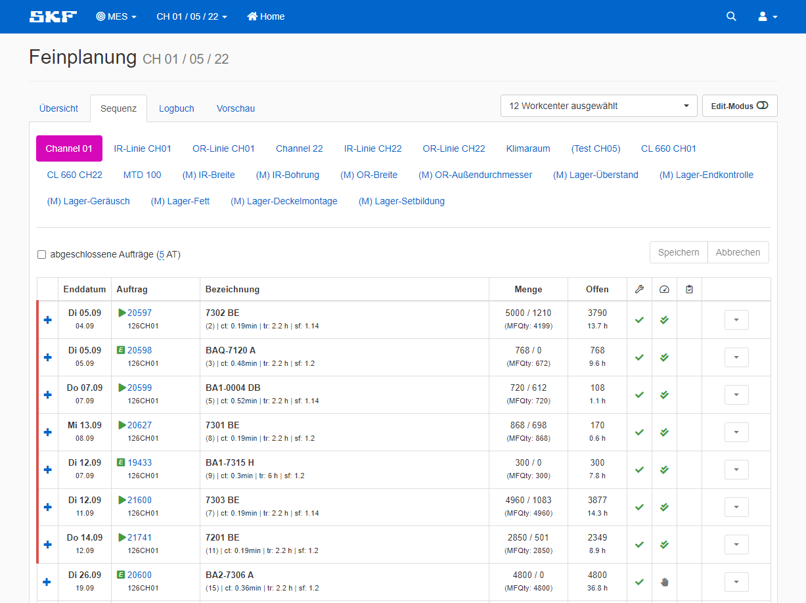
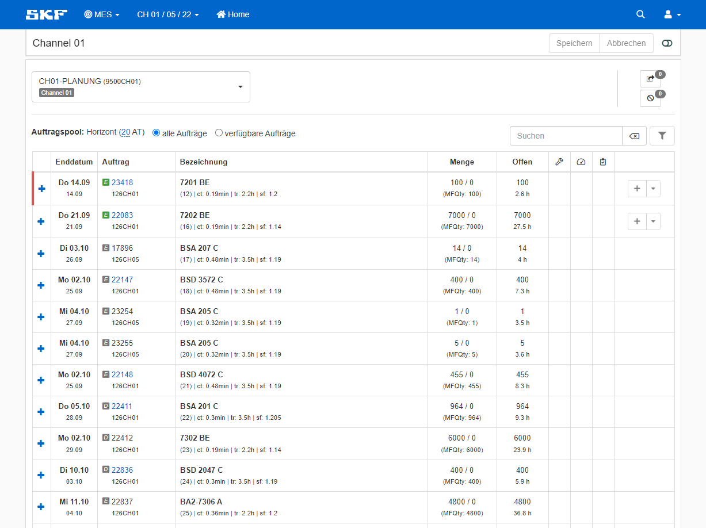

Der Bereich <b>Sequenz</b> ist das Herzstück der Feinplanung. Hier werden die Aufträge einer Abteilung verwaltet.
Dies geschieht in der Regel durch den Vorarbeiter und erfordert bestimmte Zugriffsrechte.
Es besteht die Möglichkeit Aufträge auf den Maschinen feinzuplanen, sie über den Share-Bereich auf einem anderen Channel zu fertigen oder sie komplett 
zu stornieren.

 

## Auftragpools

Die Sequenz gliedert sich grundsätzlich in zwei Ansichten. 
In der oberen Ansicht werden die Maschinen/Arbeitsbereiche angezeigt, sowie der obere Auftragspool.
Im oberen Pool befinden sich alle Aufträge, die bereits einer Maschine zugewiesen sind.
Ist ein Auftrag einer Maschine zugewiesen, nennt man das feinverplant.  

 
Die untere Ansicht zeigt den Pool mit den verfügbaren Aufträgen. 
Feinverplant können lediglich die Aufträge werden, bei denen dieses Symbol <FontAwesomeIcon icon="fa-solid fa-square-e" style={{color: "#17ab35"}} />
neben der Auftragsnummer steht.
Auch daran zu sehen, dass in der letzten Spalte kein Plus-Button ist, um den Auftrag auf einer Maschine feinzuplanen.

Ist das Symbol grau, so muss der Auftrag von den Planern erst freigegeben werden.

