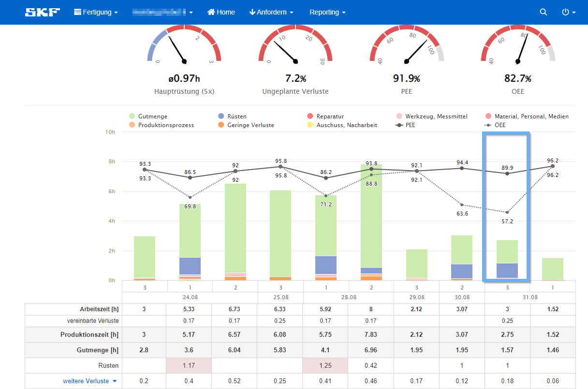

## Allgemein

Der Schichtreport fasst die wichtigsten Daten eines Arbeitsplatzes auf einer Seite zusammen.   
Hier kann die produzierte Stückzahl über einen ausgewählten Zeitraum eingesehen werden,
sowie vereinbarte, geplante und ungeplante Verluste, welche auf diesem Arbeitsplatz aufgetreten sind.       
Im oberen Bereich befinden sich vier Barometer. 
Das erste zeigt die durchschnittliche Rüstzeit an.
Der blaue Bereich gibt die geplante Rüstzeit an, je nachdem wo die Nadel liegt, wird diese eingehalten, unter- oder überschritten.  
Das zweite Barometer zeigt die ungeplanten Verluste in Prozent über den ausgewählten Zeitraum an.  
Das dritte und vierte Barometer zeigen den OEE- und den PEE-Wert des Arbeitsplatzes an. 
Was diese beiden Kennzahlen aussagen, wird in den jeweiligen Unterpunkten erklärt. 

 

    <Sr2Carousel/>

## OEE - Overall Equipment Effectiveness 

### Was ist OEE?
OEE steht für Overall Equipment Effectiveness und ist ein internationaler Standard zur Messung von Fertigungsproduktivität.
Anders ausgedrückt: Der OEE-Wert ermittelt den Prozentsatz der Fertigungszeit, der tatsächlich produktiv ist. 
Ein OEE-Wert von 100% bedeutet, dass wir so schnell wie möglich und ohne Rüstzeit nur gute Teile herstellen. 

Durch die Messung des OEE-Wertes und der zugrunde liegenden Verluste gewinnen wir wichtige Erkenntnisse, wie wir den Fertigungsprozess 
systematisch verbessern können.
 

### Wie setzt sich OEE zusammen?
Der OOE-Wert setzt sich aus den Faktoren Verfügbarkeit, Leistung und Qualität unter Berücksichtigung der Verluste zusammen.

#### Verfügbarkeit

:::note Berechnung 
Verfügbarkeit = available Hours / scheduled Hours
:::

Die Verügbarkeit wird intern durch die sogenannten *Available Hours* (verfügbare Stunden) definiert.
Die *Available Hours* erhält man, wenn man die *Scheduled Hours* (geplante Stunden) nimmt und alle 
geplanten Verluste, wie etwa das Rüsten sowie alle Verfügbarkeitsverluste abzieht.  
Verfügbarkeitsverluste sind:

- Kurze Instandhaltungsarbeiten
- Werkzeugprobleme
- Rüsten
- Rüsten auf andere Material Family
- Warten auf First-Off (Freigabe)
- Fehlendes Material
- Zu wenig Personal
- Warten auf Anweisungen
- Warten auf andere Instanz

 

#### Leistung

:::note Berechnung 
Leistung = performance Hours / available Hours
:::

Die Leistung wird durch die sogenannten *Performance Hours* (Leistungsstunden) definiert.
Diese ergeben sich durch die *Available Hours* abzüglich der Leistungsverluste. 

Unter Leistungsverluste fallen zum einen *Process Adjustments*. Also Anpassungen
oder Nachjustierungen am Prozess.
Einträge die unter diesen Verlust fallen sind sehr oft Fälle von Werkzeugproblemen. 
Zum Beispiel, wenn ein*e Mitarbeiter*in mehrere Anpassungen am Treiber vornimmt, ihn öfter schleift 
ihn abnimmt, den Plan säubert und ihn erneut wieder montiert usw., bis er*sie herausfindet, 
dass der Treiber getauscht werden muss. 
Die Zeit in der diese Anpassungen stattfinden, fallen unter Leistungsverlust.

Zum anderen fallen darunter kleine Stillstände wie etwa wenn sich ein Ring im Flex-Link verharkt. 
Sind meist nur Stillstände von 1-2 Minuten, summiert kommen aber doch wieder eine gewisse Zeit zusammen.
Auch Abweichungen von der Zykluszeit fallen unter Leistungsverluste.
 

#### Qualität

:::note Berechnung 
Qualität = effective Hours / performance Hours
:::

Die Qualität wird im OEE-Kontext durch die *Effective Hours* (tatsächlich produzierte Stunden) definiert.
Diese ergeben sich durch die *Performance Hours* abzüglich der Qualitätsverluste.  

Unter Qualitätsverlust wird einfach Ausschuss und Nacharbeit verstanden.
Der Ausschuss schmälert die Stückzahl der Gutmenge und die Nacharbeit erhöht die tatsächliche Nettolaufzeit.

 

#### OEE-Wert berechnen

:::note Berechnung 
OEE = Verfügbarkeit x Leistung x Qualität
:::

Den OEE-Wert erhält man, wenn man die drei Faktoren Verfügbarkeit, Leistung und Qualität miteinander multipliziert.
Im besten Fall wäre der OEE-Wert 1, dieser ist jedoch in der Realtiät kaum erreichbar.

## PEE - Production Equipment Effectiveness

### Was ist PEE?
Der PEE-Wert ist ein interner Standard der SKF-Gruppe und ist für eine detailliertere Statistik der einzelnen Bereiche eingeführt worden. 
Dieser wurde aus folgendem Grund eingeführt:

Beim OEE-Wert fließt der Faktor Rüsten mitein. Die Rüstdauer ist allerdings nicht in allen Bereichen gleich.
Bereiche mit kleineren Stückzahlen rüsten weit öfter wie Bereiche mit größeren Stückzahlen.
Ergo wird ein Bereich mit kleineren Losgrößen immer schlechter performen wie ein Bereich mit großen Stückzahlen, 
egal wie effizient dieser arbeitet.

Um diesen Faktor auszugleichen und ein klares Resultat zu erhalten wurde der PEE-Wert eingeführt.
Dieser nimmt einfach das Rüsten aus der Berechnung heraus und somit sind in dieser Formel alle Bereiche als
gleich zu betrachten.
 

### Wie setzt sich PEE zusammen?
Der PEE-Wert berechnet sich exakt wie der OEE-Wert, mit dem Unterschied,
dass anstatt der *Scheduled Hours* die *Production Hours* hergenommen werden.
Die *Production Hours* berechnen sich durch die *Scheduled Hours* abzüglich der geplanten Verluste.
Dadurch wird das Rüsten ausgeschlossen und der Unterschied zwischen den Bereichen wird ausgeglichen.

Die Berechnungen sehen nun wiefolgt aus:

:::note Verfügbarkeit 
Verfügbarkeit = available Hours / scheduled Hours
:::
 
:::note Leistung 
Leistung = performance Hours / available Hours
:::

:::note Qualität 
Qualität = effective Hours / performance Hours
:::

:::note PEE 
PEE = Verfügbarkeit x Leistung x Qualität
:::

Wie hier zu sehen ist, hat sich als einziges die Formel für die Berchnung der Verfügbarkeit geändert,
die restlichen Formeln sind gleich geblieben.
 

### Vergleich OEE - PEE

Wie man hier sehen kann liegt der OEE-Wert lediglich bei 57,2%. Etwas mager könnte man meinen, 
allerdings wurde hier etwas mehr als ein Drittel der Zeit zum Rüsten verwendet, was wiederum beim OEE-Wert als 
Verlust verbucht wurde und diesen gewaltig schmälert.

Der PEE-Wert hingegen liegt bei 89,9%. Der Bereich hat also gut performt, was allerdings nur über den PEE-Wert ersichtlich ist.

## Dokumente

Wenn ihr euch genauer in das Thema einlesen wollt, gibt es hier noch zwei Dokumente, die sich ausführlich mit den Themen OEE, PEE und Reporting im 
MES beschäftigen.
Zum einen gibt es ein Word-Dokument, dass auf die genaue Defintion von OEE und dessen Bestandteile in der SKF-Gruppe eingeht
und zum anderen gibt es eine Powerpoint-Präsentation, welche das Word-Dokument zusammenfasst.  

<HiddenLink link="https://skfgroup-my.sharepoint.com/:w:/g/personal/christoph_lengauer_skf_com/EWPV065jTBlEpRtLr2NAR30B__ByKyCl0e2UndI7I2g3Eg?e=DmEdgs" label="Word-Dokument"/>

<HiddenLink link="https://skfgroup-my.sharepoint.com/:p:/g/personal/christoph_lengauer_skf_com/EV38OPGB7tVDt6vlrKEq0mMB-eXjvjOTdAM_DdIPbtukfA?e=x85iAp" label="PowerPoint-Präsentation"/>

