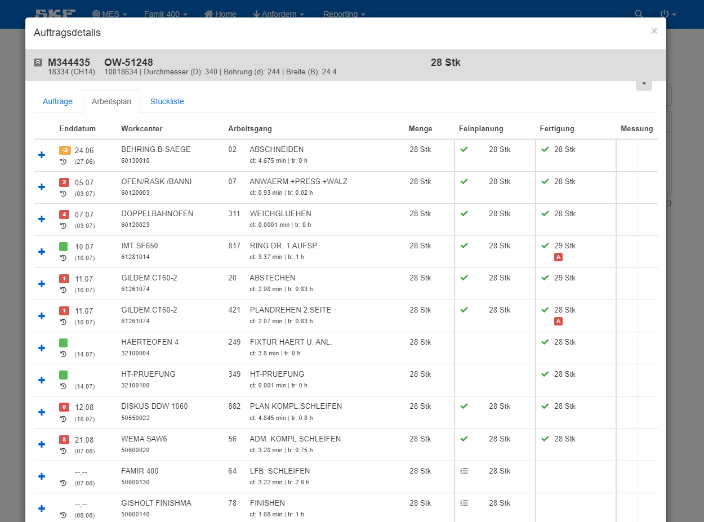
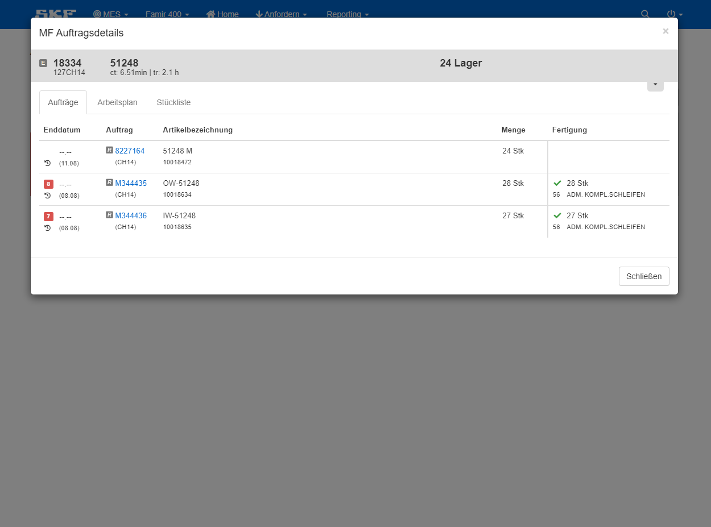
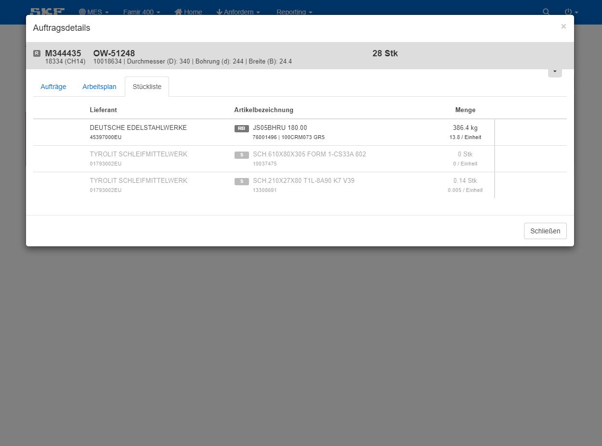

Die Ansicht Auftragsdetails enthält folgende drei Komponenten:

- [Arbeitsplan](#arbeitsplan)
- [Aufträge](#aufträge)
- [Stückliste](#stückliste)

 

Um zu den Auftragsdetails zu gelangen, bitte diesen Schritten folgen:
 
 

<ActivateAssignmentDetails/>

## Arbeitsplan

    Unter dem Reiter Arbeitsplan sind alle Operationen eines Auftrages gelistet. Der Arbeitsplan geht beispielsweise vom Abschneiden übers Härten in der Halle 1 
    bis zum Finishen in die Halle 2.
    Hier können alle Details zu den bisherigen Operationen eingesehen werden, wie etwa Gutmenge, Ausschuss und Nacharbeit, welche Menge feinverplant und welche tatsächlich
    gefertigt wurde und noch vieles mehr.
 
 

## Aufträge

Unter dem Reiter Aufträge sind alle M- und 8er-Nummern aufgelistet die zu einem Lager gehören.
 
 

:::caution
Wenn man auf den Reiter Aufträge klickt, werden die Reiter Arbeitsplan und Stückliste ausgegraut. 
Das hat den Grund, da nun die Aufträge angezeigt werden, die zum fertigen Lager gehören und kein Auftrag ausgewählt ist. 
Man muss nun wieder einen Auftrag anwählen, um den Arbeitsplan und die Stückliste von diesem einsehen zu können.
:::

 

## Stückliste

    Unter dem Reiter Stückliste sind alle Komponenten aufgelistet, aus denen das Produkt besteht, wie etwa Käfig, Fett, Innenring, Außenring usw.
    Zusätzlich sind hier auch noch die Schleifmittel aufgelistet, welche für die Bearbeitung nötig sind, wie etwa Scheiben und Hohnsteine.

    
 
 

 