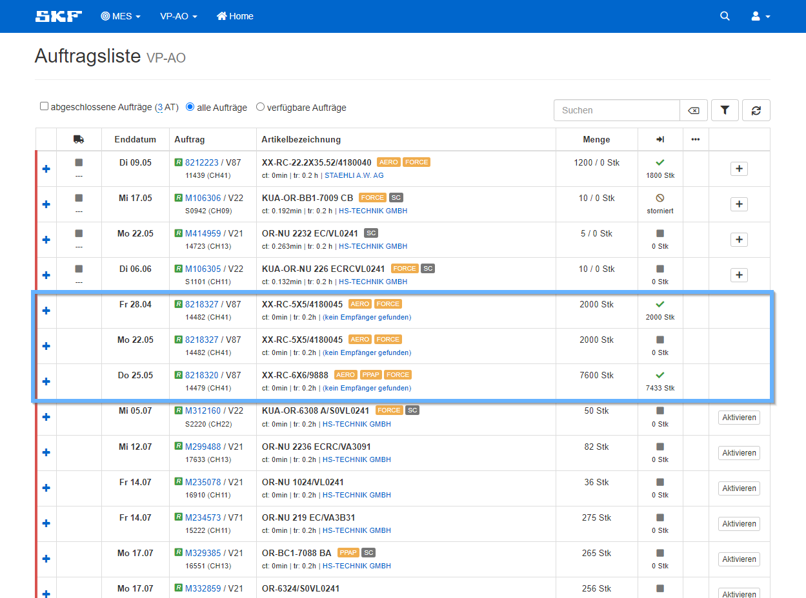

    Es gibt einige wenige Arbeitsplätze, bei denen die Auftragsplanung nicht vom Vorarbeiter durchgeführt wird. 
    In den meisten Bereichen läuft es im Regelfall so ab, dass der Vorarbeiter im MES die Aufträge feinverplant und 
    Mitarbeiter diesen anschließend rückmelden können.
    Bei Arbeitsplätzen, wo die Auftragsaktivierung aktiv ist, fällt die Feinverplanung durch den Vorarbeiter weg und Mitarbeiter führen diese selbstständig durch.

 

## Aktivierung möglich

    <ActivateAssignmentCarousel/>

## Aktivierung nicht möglich

    Es ist möglich, dass weder der Aktivieren- noch der Plus-Button angezeigt werden. 
    Sollte das der Fall sein, liegt irgendwo ein Fehler vor. Hier bitte den zuständigen Planer oder uns kontaktieren.

 

