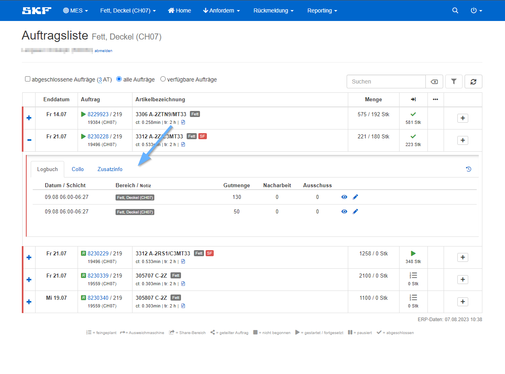
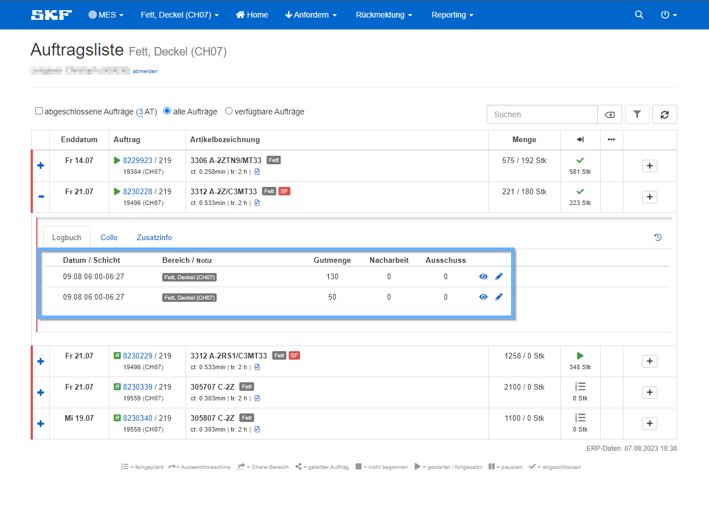
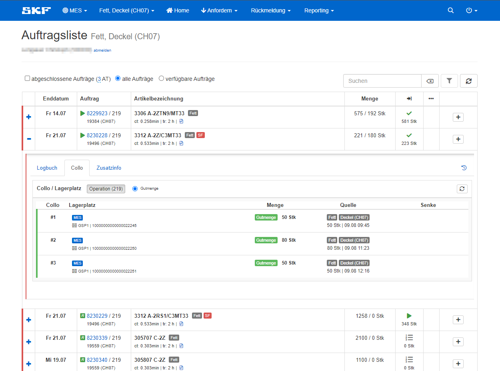
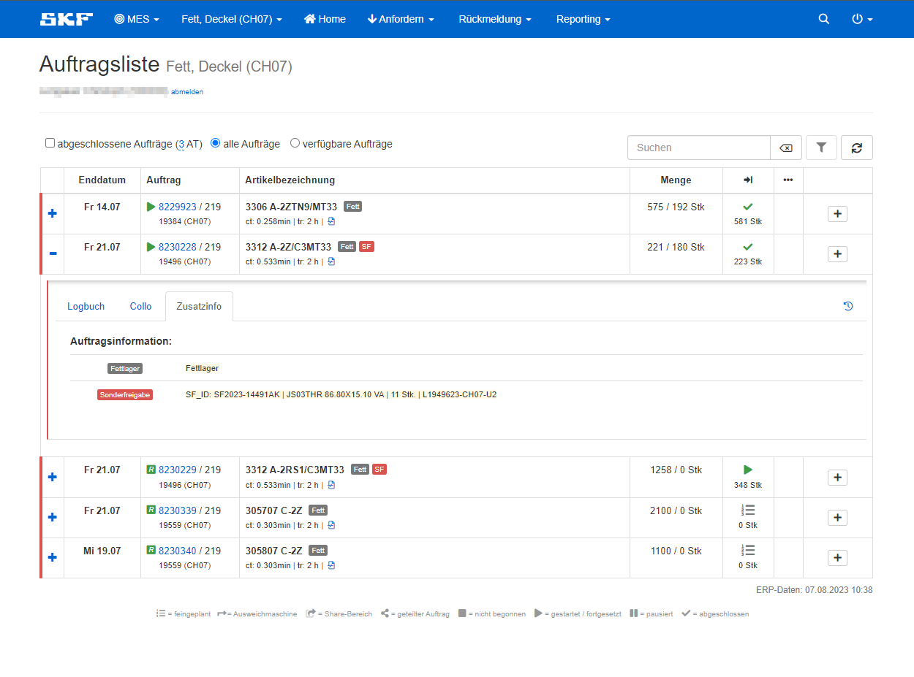

Wenn man in der Ansicht *Auftragsliste* eines Arbeitsplatzes einen Auftrag ausklappt, stehen einem drei Reiter zur Verfügung. 

- Logbuch
- Collo
- Zusatzinfo

 

### Logbuch

Im Bereich Logbuch sind alle Rückmeldunge zu sehen, die bis zum jetzigen Zeitpunkt auf dem Auftrag gemacht wurden.  

### Collo

Im Bereich Collo können alle Collos eingesehen werden, die bis zum jetzigen Zeitpunkt abgestellt worden sind. 
Unter Lagerplatz sieht man, ob es ein MES oder WMS Lagerplatz ist.
Unter Menge wird die gefertigte Gutmenge zu jedem Collo angezeigt.
Bei Quelle ist der Zeitstempel einsehbar, an dem das Gebinde abgestellt wurde und unter Senke ========= TEXT FOLGT NOCH =========    

### Zusatzinfo

Unter Zusatzinfo sind spezielle Informationen hinterlegt, die den Auftrag betreffen, wie etwa in diesem Beispiel, dass es Fettlager sind und 
das eine Sonderfreigabe nötig ist. 
Diese Infos sind auch auch gleich neben der Typenbezeichnung eines Auftrages abgebildet, wie hier **Fett** für Fettlager und **SF** für Sonderfreigabe.  

Zusätzlich kann der Vorarbeiter noch eine Feinplanungsinfo als Notiz anfügen, falls es noch etwas beim Fertigen des Auftrages zu beachten gibt.

