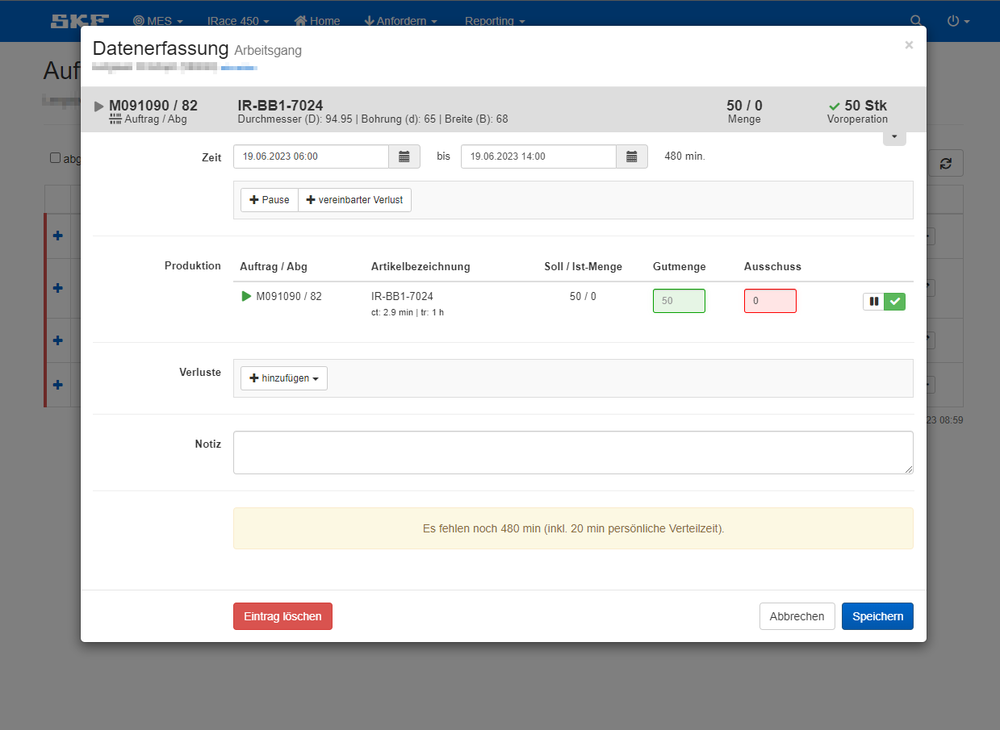
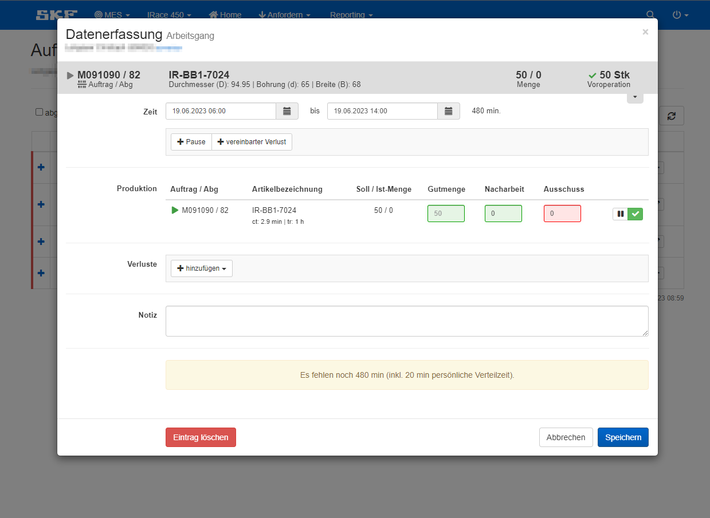
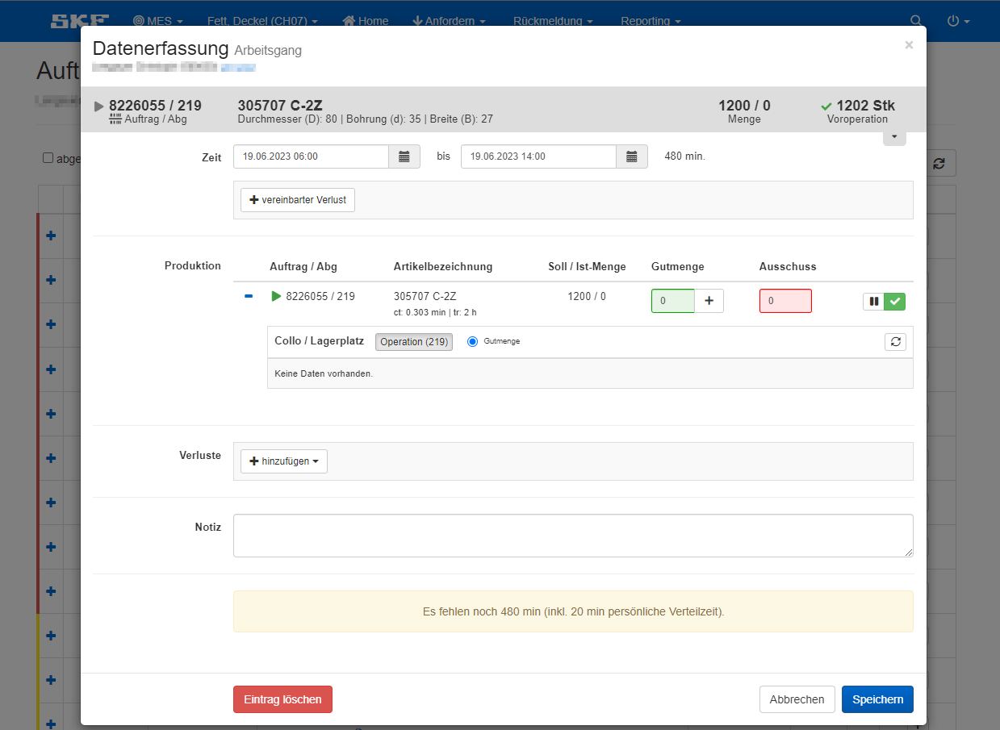
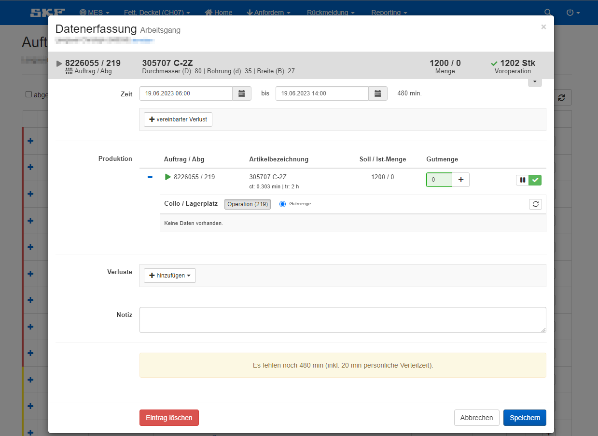
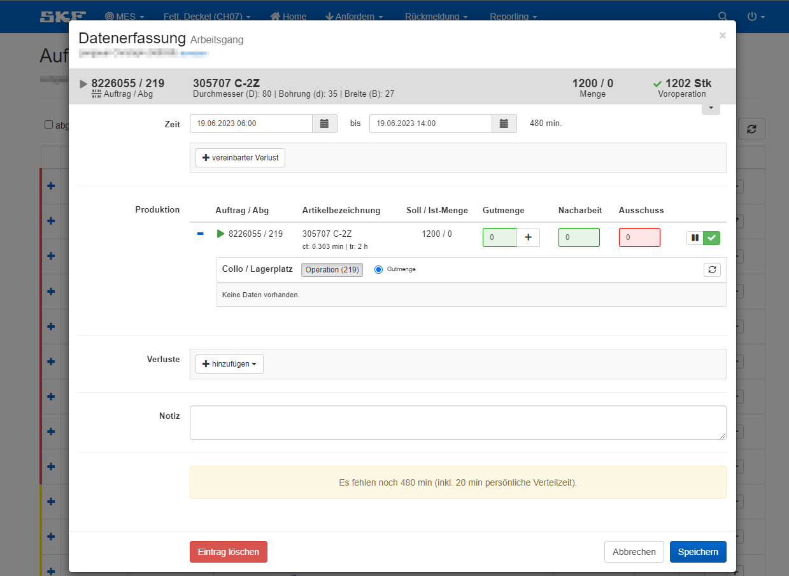
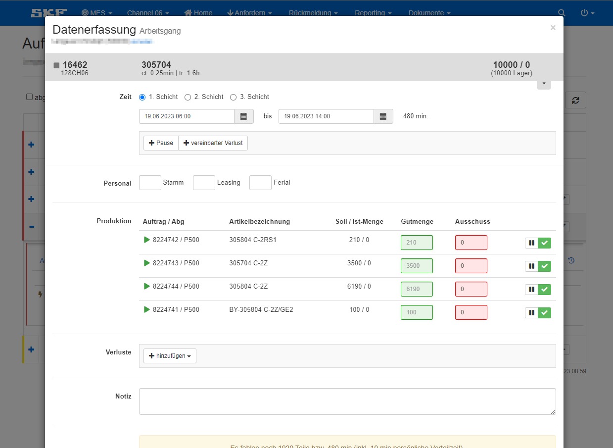
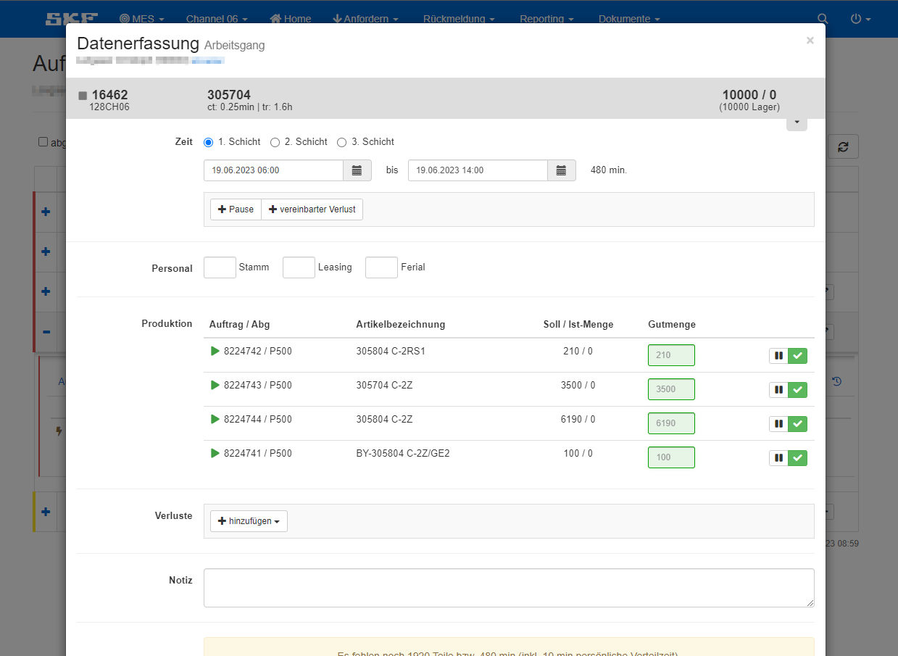
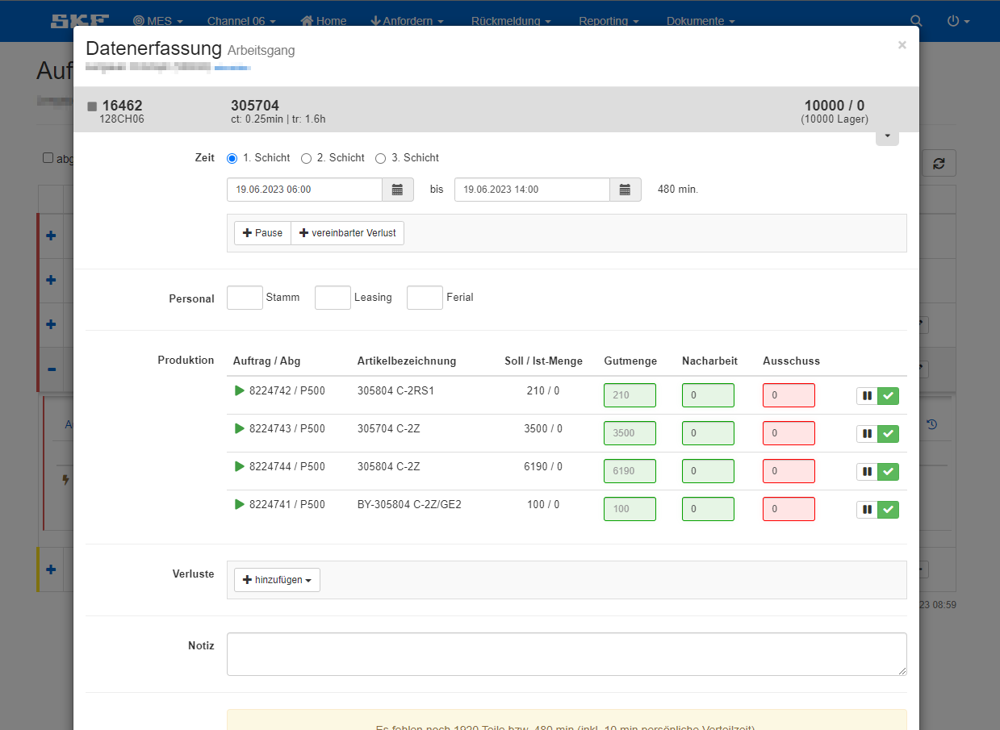

    Die Menge kann in Gutmenge, Nacharbeit und Ausschuss erfasst werden oder durch eine beliebige Kombination dieser drei Optionen. Zusätzlich kann in Bereichen, wo Gebinde abgestellt werden, noch die Option hinzugefügt werden, ein Etikett (Collo) auszudrucken, welches mit den nötigen Auftragsdaten und einem Barcode versehen ist und am Gebinde angebracht wird. 
    Auf Volumenchannels wird die Menge nicht pro Auftrag sondern pro Material Family (MF) erfasst. 
    
    Je nach Art der Rückmeldung sieht die Maske etwas anders aus. 

### Ohne Collo

    Dies ist die gängiste Art der Rückmeldung. Hier kann die Menge in Gutmenge, Ausschuss und Nacharbeit erfasst werden.
    Es wird die Menge eingetragen, wenn nötig werden Verluste hinzugefügt und anschließend wird die Rückmeldung im System abgespeichert.  

<Tabs className="unique-tabs">
<TabItem value="Gutmenge - Ausschuss">

</TabItem>

<TabItem value="Gutmenge">

</TabItem>

<TabItem value="Gutmenge - Nacharbeit - Ausschuss">

</TabItem>

</Tabs>

### Mit Collo

Hier kann die Menge ebenfalls in Gutmenge, Ausschuss und Nacharbeit erfasst werden. Hier wird allerdings auf Gebindeebene abgestellt.
Das heißt, wenn die Stückzahl für ein Gebinde erreicht ist, wird diese eingetragen, das Collo wird gedruckt und am Gebinde angebracht.
Was genau ein Collo ist erfährst du [hier](./mit-collo.mdx).

<Tabs className="unique-tabs">
<TabItem value="Gutmenge - Ausschuss">

</TabItem>

<TabItem value="Gutmenge">

</TabItem>

<TabItem value="Gutmenge - Nacharbeit - Ausschuss">

</TabItem>

</Tabs>

### Volumechannels

Auf Volumechannels besteht ein Auftrag in der Regel aus mehreren Material Families (MF). Das heißt, ein Auftrag 
ist aufgeteilt auf mehrere kleine Aufträge. 
Funktioniert genau wie bei der Rückmeldung ohne Collo.  

<Tabs className="unique-tabs">
<TabItem value="Gutmenge - Ausschuss">

</TabItem>

<TabItem value="Gutmenge">

</TabItem>

<TabItem value="Gutmenge - Nacharbeit - Ausschuss">

</TabItem>

</Tabs>

