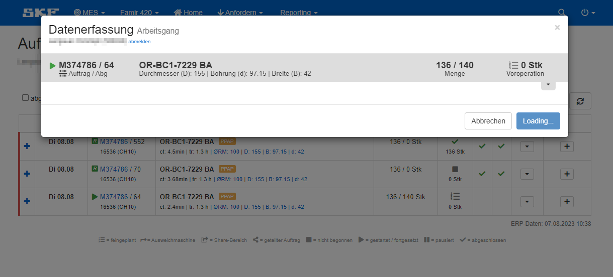
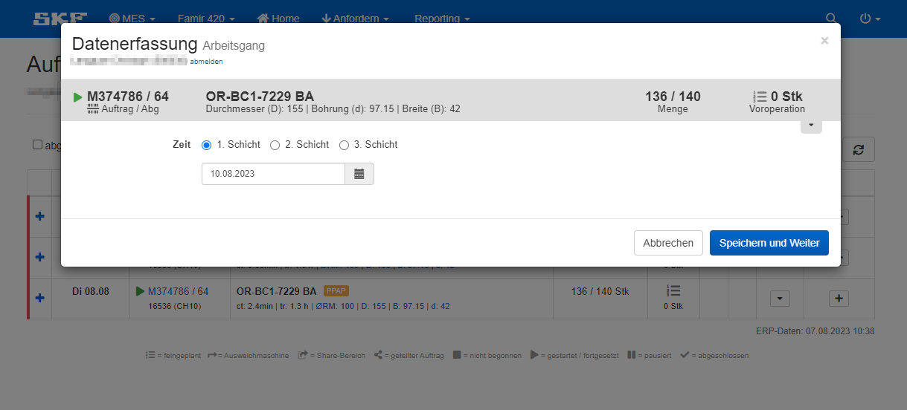
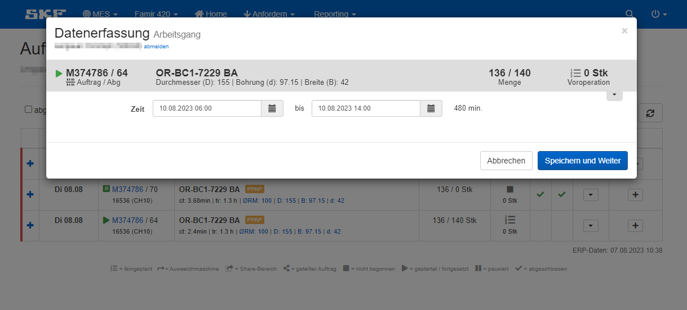

Die Zeit in der ein Auftrag gefertigt wird kann auf verschiedene Arten erfasst werden.
Je nach Bedarf des Channels kann zwischen folgenden Arten gewählt werden<!--  -->:

<Tabs className="unique-tabs">

<TabItem value="Datum - Zeit - Schicht - Verluste">

:::info

*Diese Form der Zeiterfassung wird auf den meisten Channels eingesetzt.*

:::

Hier werden Schicht, Datum, Zeit und Verluste erfasst.

Du musst also die Schicht und den genauen Zeitrahmen angeben, in dem du an dem Auftrag gearbeitet hast. Zusätzlich ist hier im System noch die Zykluszeit für den Auftrag hinterlegt. Wird hier die kalkulierte Zeit für die Auftragsbearbeitung nicht erreicht, müssen die Gründe dafür angegeben werden.
Diese Gründe nennt man Verluste.

</TabItem>

<TabItem value="Datum - Zeit - Schicht">

Hier werden Schicht, Datum und Zeit erfasst.

Du musst also die Schicht und den genauen Zeitrahmen angeben, in dem du an dem Auftrag gearbeitet hast. Wird meist bei neuen Maschinen eingesetzt, bis diese vollständig prozessfähig sind.

</TabItem>

<TabItem value="Zeitstempel">

Hier werden Zeit und Datum automatisch erfasst.

Du musst nichts eingeben. Du klickst einfach nur auf das <FontAwesomeIcon icon="fa-plus" size="xl" color="#0066cc"/> Symbol bei deinem Auftrag und das System trägt automatisch Zeit und Datum für dich ein.

</TabItem>

<TabItem value="Datum - Zeit">

Hier werden Zeit und Datum erfasst.

Du musst also den genauen Zeitrahmen angeben, in dem du an dem Auftrag gearbeitet hast.

</TabItem>

<TabItem value="Datum - Schicht">

Hier werden nur Datum und Schicht erfasst.

Du musst also Datum und Schicht angeben, an dem du an dem Auftrag gearbeitet hast.

</TabItem>

<TabItem value="Datum - Zeit - Verluste">

Hier werden Zeit, Datum und Verluste erfasst.

Du musst also den genauen Zeitrahmen angeben, in dem du an dem Auftrag gearbeitet hast. Zusätzlich ist hier im System noch die Zykluszeit für den Auftrag hinterlegt. Wird hier die kalkulierte Zeit für die Auftragsbearbeitung nicht erreicht, müssen die Gründe dafür angegeben werden.
Diese Gründe nennt man Verluste.

</TabItem>

</Tabs>

