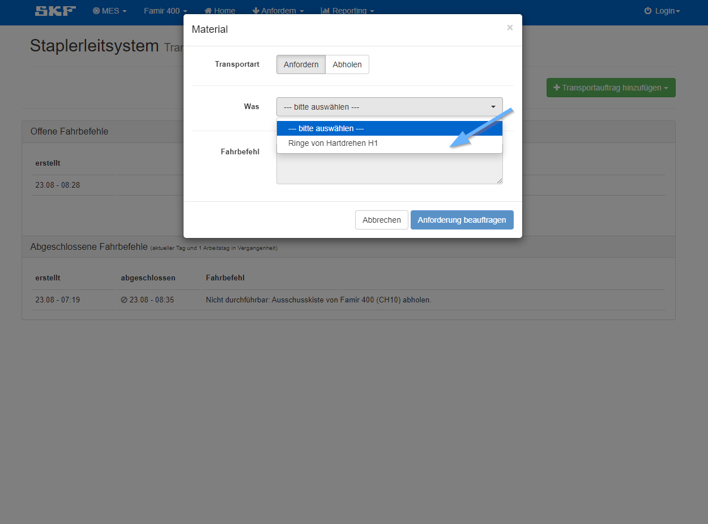

Über das Staplerleitsystem können verschiedene Fahrbefehle an Staplerfahrer*innen und FTS erteilt werden.  
Folgende Varianten von Fahrbefehlen stehen zur Verfügung:
    

- Material
- Abfall
- Leergut
- Werkzeug

Bei Material und Leergut können Aufträge für das Anfordern oder das Abholen erteilt werden.
Bei Abfall ist nur die Option Abholen verfügbar und Werkezeug kann ebenfalls nur angefordert werden.
Unter Werkzeug wird hier meist das Anfordern von Schleifmittel aus der Halle 4 verstanden.

 

## Neuer Fahrbefehl

<SlsCarousel/>

## Neuer Transportauftrag

Solltet ihr einen neuen Transportauftrag benötigen, sprich eine weitere Option auf einer Maschine 
wie beispielsweise eine Anlieferung der Ringe aus der Plangruppe, schreibt bitte eine Mail 
an Harald oder Lea:

- harald.krendlsberger@skf.com
- lea.orbes@skf.com

 

