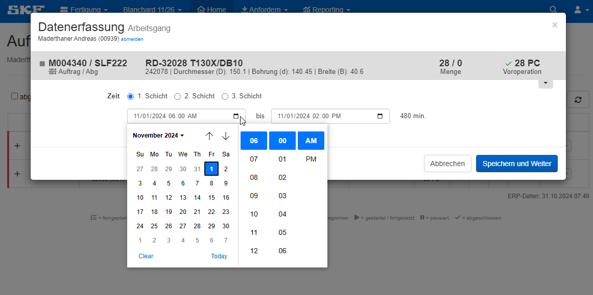
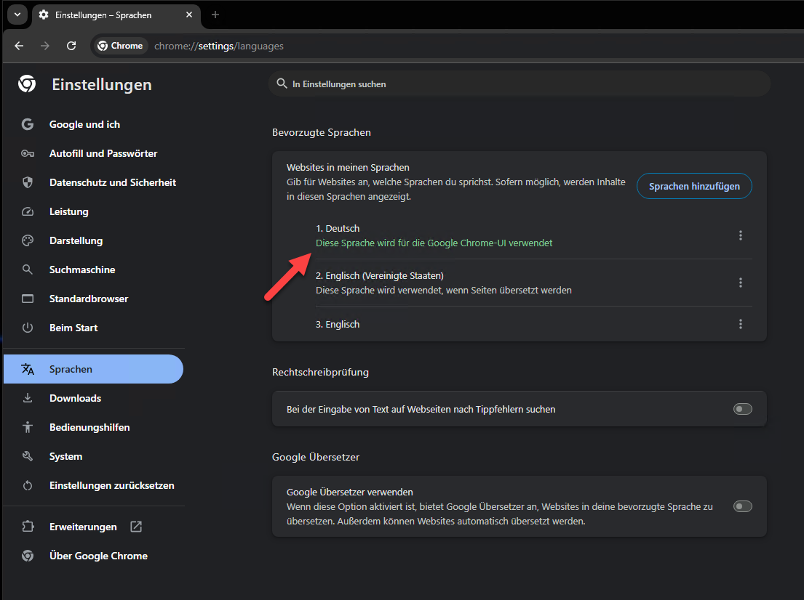

## Englische Uhrzeit bei Rückmeldung umstellen

Falls beim Auswählen von Datum/Uhrzeit in der Fertigungsrückmeldung AM/PM angezeigt wird, muss eine kleine Browser-Einstellung gemacht werden.

In der Adresszeile „chrome://settings/languages“ eingeben.
Sprache Deutsch hinzufügen, falls nicht vorhanden.
Deutsch als Sprache für die Chrome-Benutzeroberfläche verwenden.

Siehe Screenshots.
 

 

