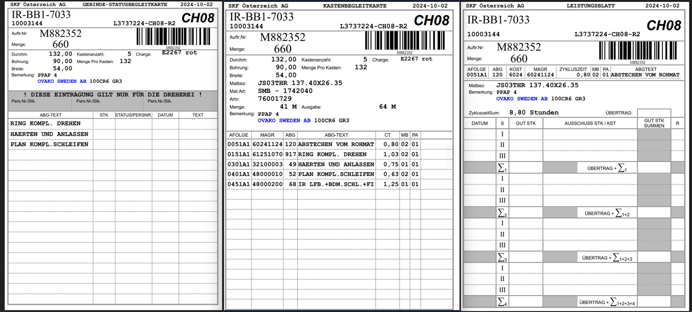

## Allgemein

    Die Auftragsbegleikarte ist das neue Dokument, dass die 
    Kastenbegleitkarte, die Gebinde- Statusbegleitkarte und das Leistungsblatt vereint und 
    in Zukunft für die Gebindedeklaration hergenommen werden soll.

 

 

## Migration

   Hier zum Vergleich nocheinmal die Gebindestatusbegleitkarte, die Kastenbegleitkarte
   und das Leistungsblatt.

 

 

   1. Der Kopf ist die Kombination von allen Dreien. 
   Wir haben hier lediglich Informationen wie Bemerkung, Maße, usw. 
   weggelassen, da diese im MES ersichtlich sind.

   2. Der Körper enthält die Operationen des Auftrags mit den neuen 
   Kostenstellen und den neuen Operation-Codes. Wie zuvor bei 
   Kastenbegleitkarte und Gebinde-Statusbegleitkarte.

   3. Die Fußzeile löst das Leistungsblatt ab. Hier können zudem
   Notizen vermerkt werden. 
   Der Übertrag vom Leistungsblatt ist im MES durch die Rückmeldung abgebildet.

 

 

## Übertrag Leistungsblatt

Der Übertrag des Leistungsblattes ist im MES in der Auftragsübersicht abgebildet.
Klickt man hier links auf das Plus, dann auf den Reiter "Logbuch", sieht man
alle Rückmeldungen dieses Auftrages und somit auch die in der letzten Schicht
abgestellte Stückzahl.
 

 
