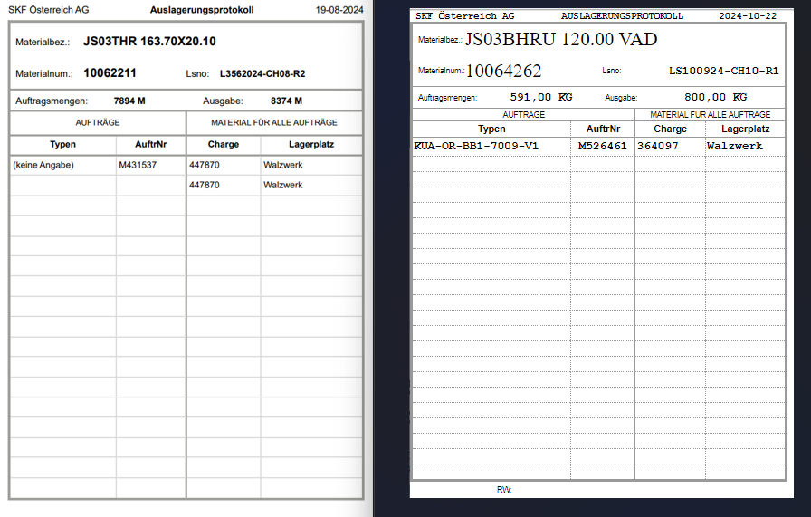

Das Auslagerungsprotokoll wurde lediglich an den neuen Standard angepasst. 
Von den Daten hat sich nichts verändert.

 

 

**Links**: Auslagerungsprotokoll neu  
**Rechts**: Auslagerungsprotokoll alt

