

    Hier nochmal die Übersicht, welche Dokumente es von nun an gibt.

## Auftragsbegleitkarte

    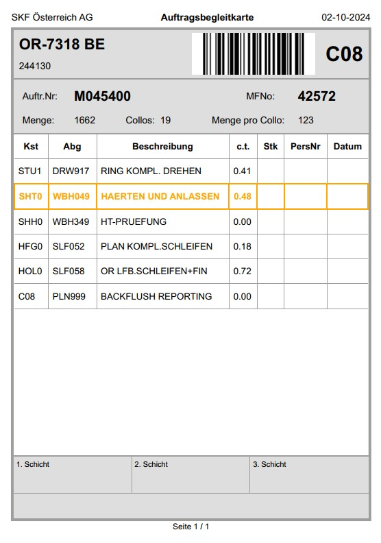

## Maschinenfreigabekarte

    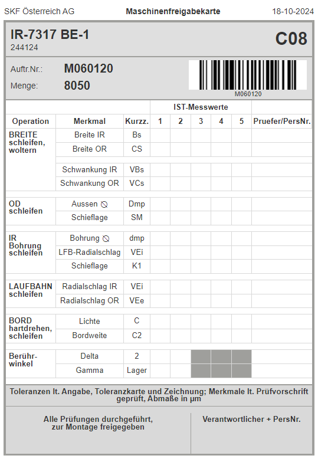

## Prüfbegleitkarte

    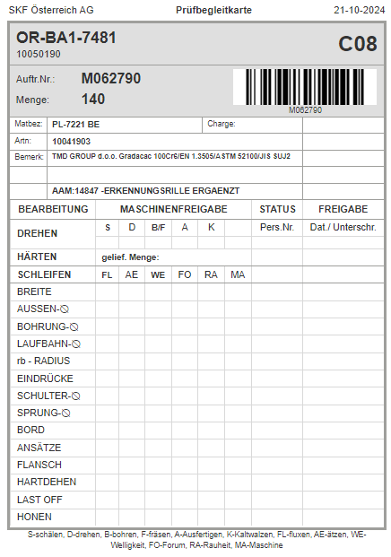

## Walzbeleg

    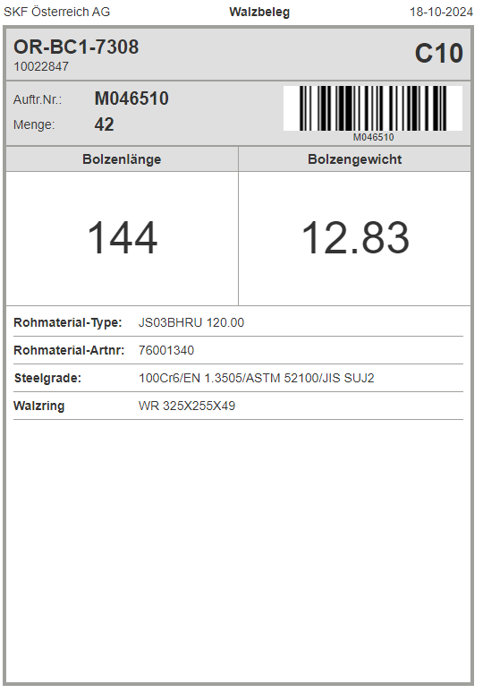

## Schneidbeleg

    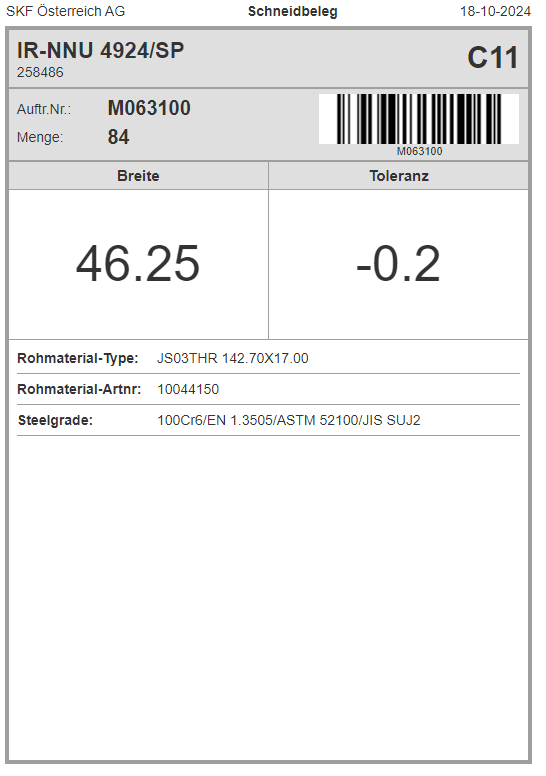

## ZVP-Schein

    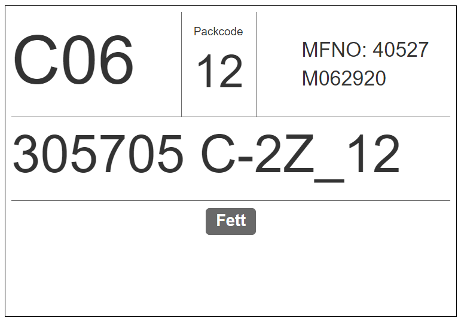

## Auslagerungsprotokoll

    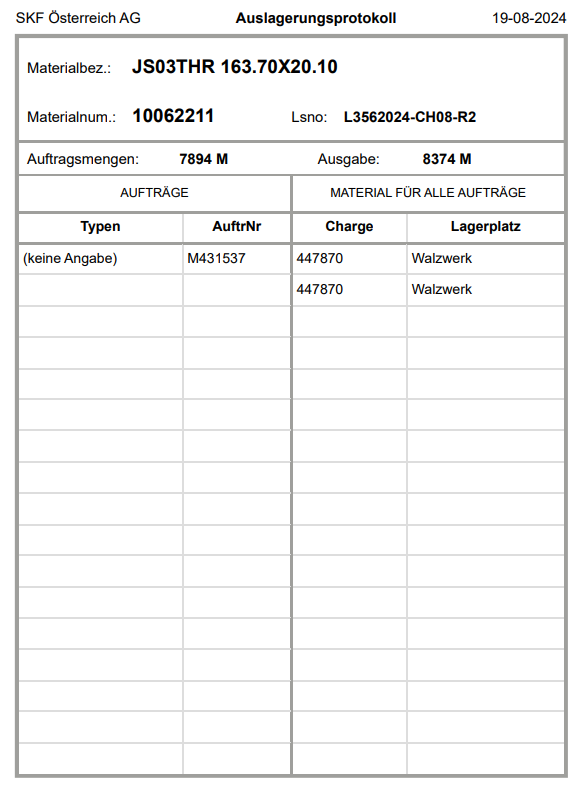

## Montagefreigabekarte

    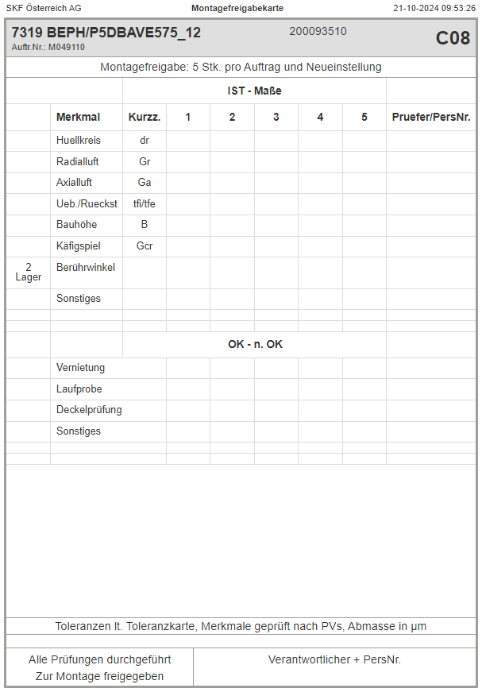

## Montagebegleitkarte

    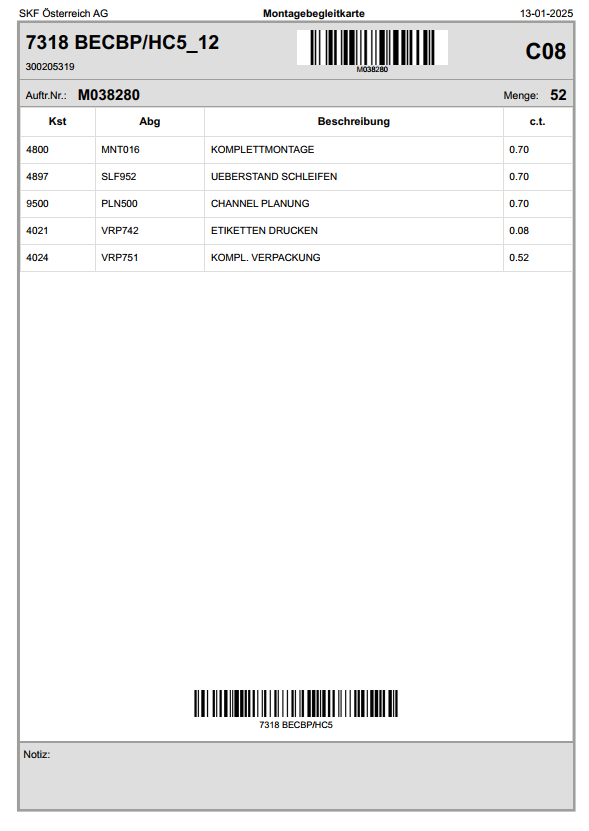

## Pack-Varianten-Sequenz

    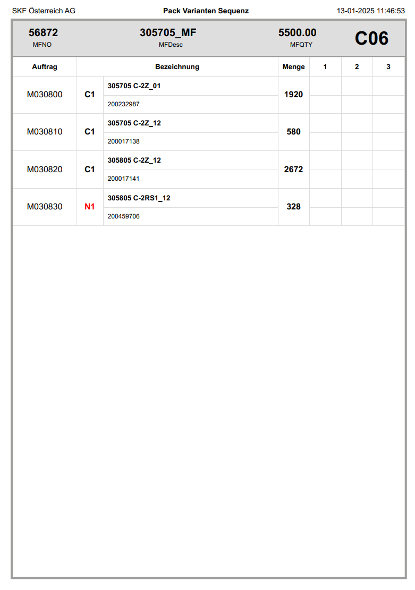

## Endprüfprotokoll

    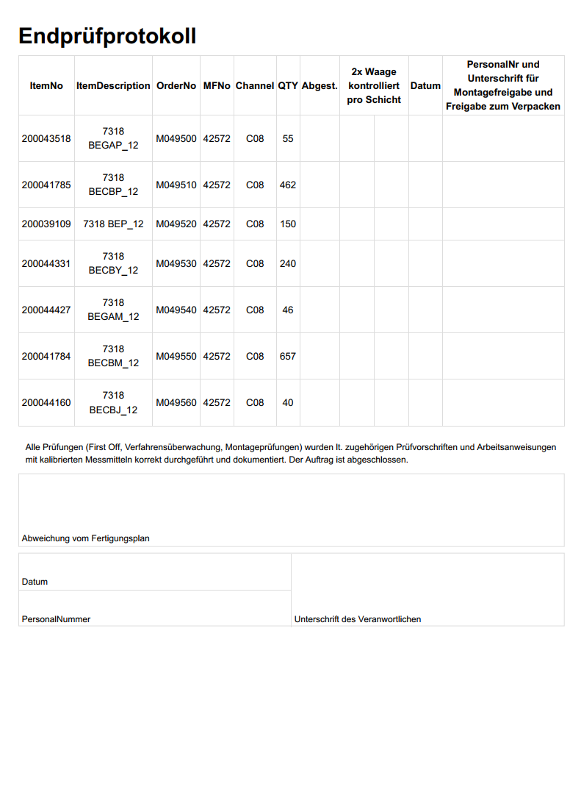

## Pack-Varianten-Begleitkarte

    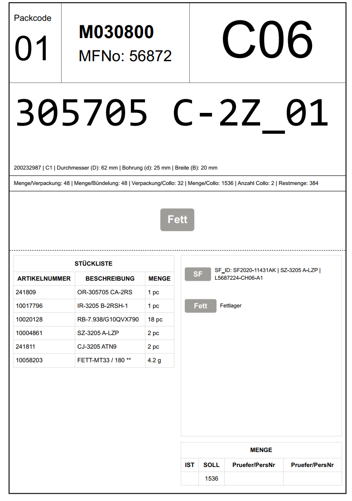

