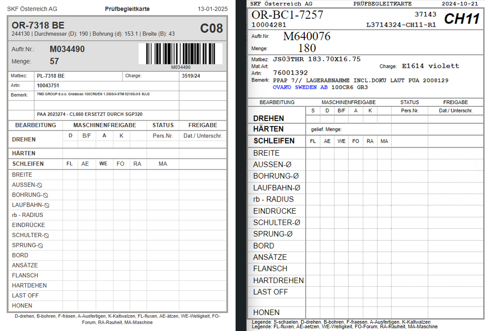
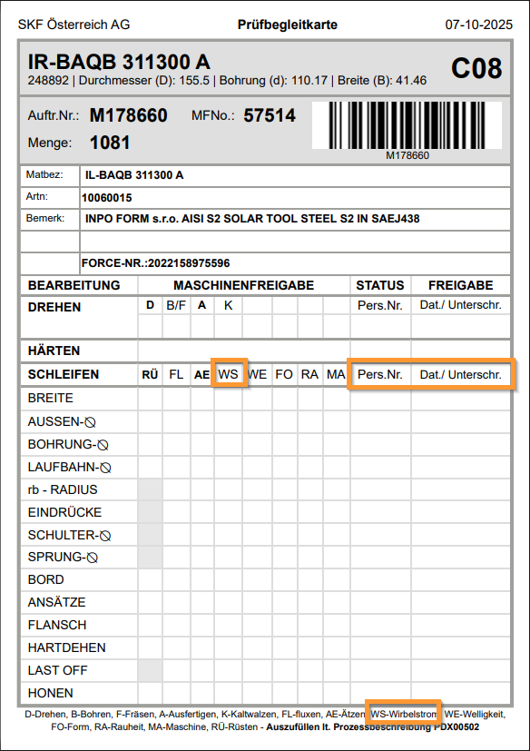

## Allgemein

 Bei der Prüfbegleitkarte wurde die Lieferscheinnummer entfernt, 
 da sie laut Umfragen auf diesem Dokument nicht benötigt wurde. 
 
 Auch die Materialart wurde entfernt, da diese ebenfalls keine Verwendung mehr hat.
 

 

 

**Links**: Prüfbegleitkarte neu  
**Rechts**: Prüfbegleitkarte alt

## Änderungsprotokoll
### 07.10.2025

 

Die Prüfbegleitkarte wurde um die Spalte **WS-Wirbelstrom** erweitert.
Zudem wurden in der Zeile **Schleifen** die Header um **Pers.Nr.** und **Dat./Unterschr.** erweitert für 
bessere Lesbarkeit.

