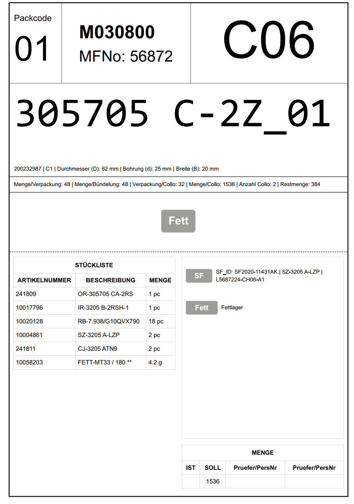

    Den alten *Einlagerungsschein* haben wir in die neue *PV-Begleitkarte* umgetauft und von den 
    Daten her abgeändert. 
     
    Der ober Teil ist für die ZVP, damit auf einen Blick ersichtlicht ist, was sich in dem Gebinde befindet. 
    Im Mittelteil sind die Maße der Lager und dessen Verpackungsinfos angedruckt.
    Der untere Teil ist für den Channel. Hier sind die Beschreibungen für die Labels und die Stückliste abgebildet.
    Im unteren Teil haben wir noch die Menge angedruckt und ein Feld für die Unterschrift freigelassen, wo Prüfer und Personalnummer
    eingetragen werden können. 

 

