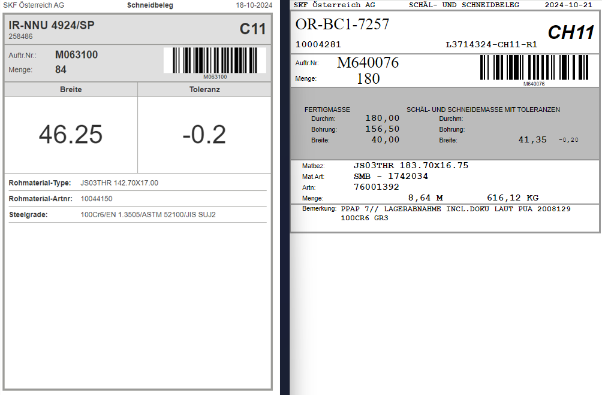

Der Schäl- und Schneidbeleg wurde durch den neuen Schneidbeleg ersetzt.
Die Infos wurden auf das nötigste gekürzt. Die Operation "Schälen" ist aus 
vergangenen Tagen, deswegen wurde das Dokument in Schneidbeleg umbenannt.

 

**Links**: Schneidbeleg neu  
**Rechts**: Schäl-und Schneidbeleg alt

