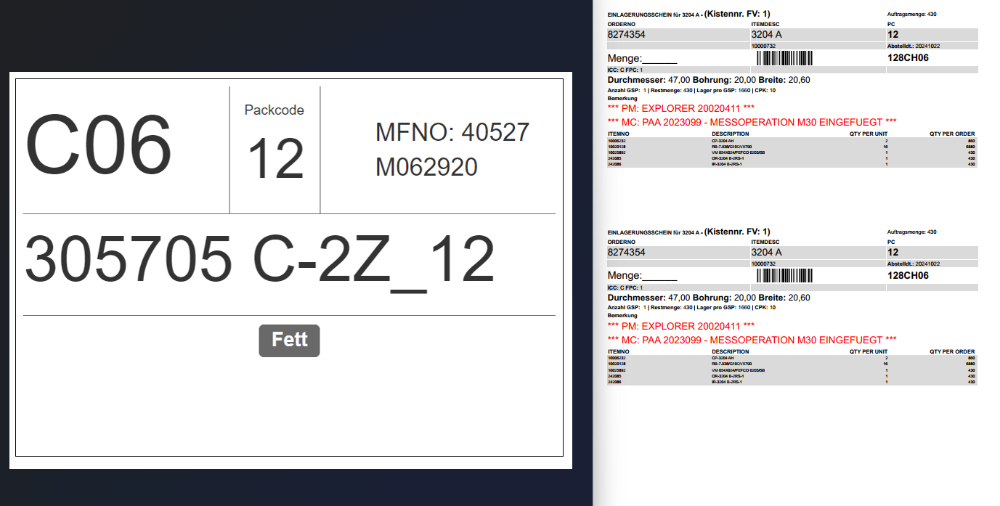

    Der Einlagerungsschein wurde zum einen dafür verwendet um Sonderoperationen bzw. Merkmale auf Lagern zu deklarieren, wie etwa das Fetten. 
    Zum anderen wurde er in der ZVP verwendet, damit die MA dort, das Gebinde auf einen Blick im Regal finden.
     
    Wir haben den neuen ZVP-Schein entworfen um es den MA in der ZVP leichter zu machen, Gebinde im Regal durch die große Schrift schneller zu erkennen. Auch haben
    wir für die Channel die Sonderoperationen bzw. Merkmale und angedruckt. 
     
    Der Plan wäre gewesen diesen Zettel komplett zu eliminieren, um weniger Papier im Umlauf zu haben, allerdings wollen wir 
    keinem die Arbeit erschweren, deswegen bleibt der Zettel, bis wir eine digitale Lösung gefunden haben.

 

**Links**: ZVP-Schein neu  
**Rechts**: Einlagerungsschein alt

